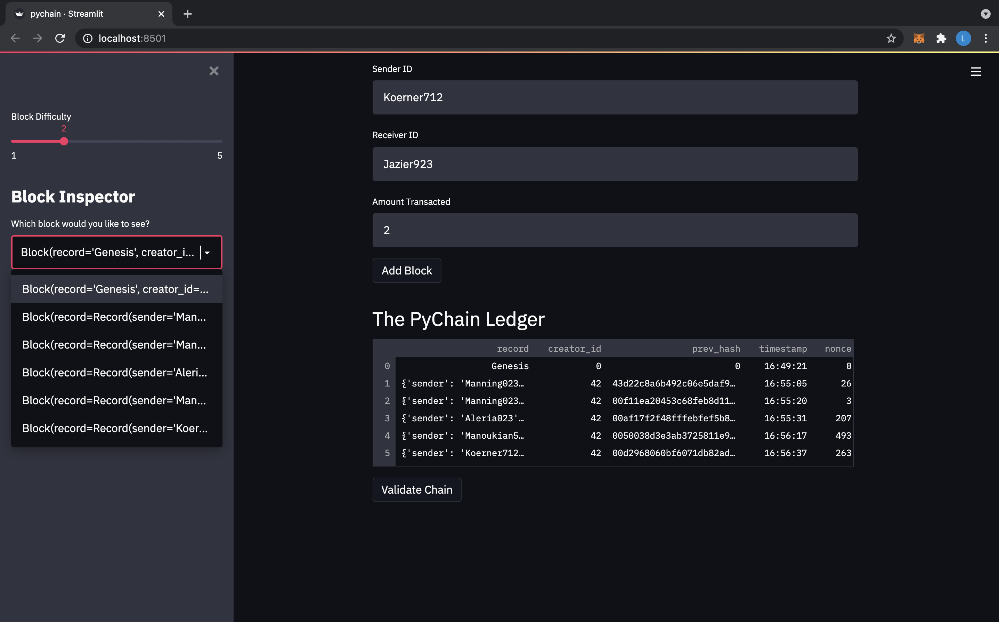
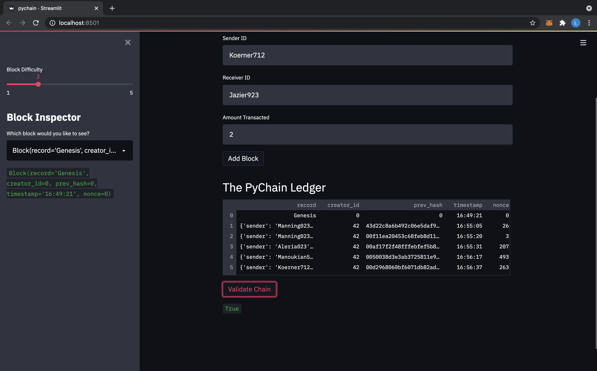

# Module_18_Challenge
In order to facilitate a decentralized finance platform, we created a blockchain-based ledger system, with a user-friendly web interface using streamlit. The ledger allows partner banks to conduct financial transaction and to verify the intergrity of the data in the ledger. 

# Technologies
The project uses the following libraries and dependencies:
* streamlit - For use of streamlit application
* pandas - For use of pandas functions
* datetime - To generate timestamp
* dataclasses - For use of @dataclass decorator
* typing - For use of any and list attributes
* hashlib - For use of hasing functions

# Summary
Afer importing the necessary libraries and dependencies, we create the Record class to to hold the values of the sender, receiver, and amount contained in future transactions. We then created the Block class and the subsquent hash_block function in order to store and encrypt all input data. The PyChain class then uses the proof_of_work function, add_block function, and is_valid function to verify and add blocks to the blockchain. The remaining code programs the user web interface to input the sender, receiver, and amount, and to then execute and store all transactions on the blockchain while maintaining record of all previous blocks, as well as the ability to validate the blockchain itself. Below are two screenshots designed to show the user web interface confirming that multiple transactions (blocks) have been successfully added to the chain, as well as that the chain has been validated. 

